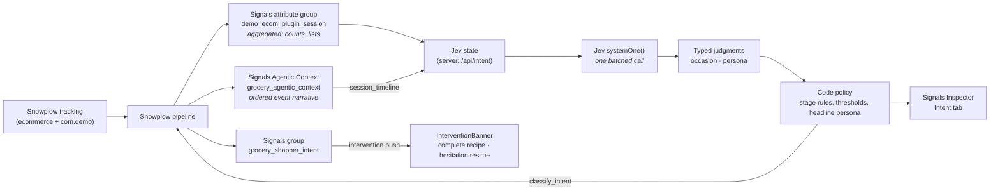

# Marketside — Jev intent classification demo

An online grocery demo (**Marketside**) that classifies *what kind of shopper is
in session, right now* using **Jev by TypeSafe AI** — a System One model that
returns typed judgments with probabilities rather than generated text.

Snowplow supplies the behavioural context; Jev interprets it; code owns the policy
(and the stage).

## The use case

Every re-evaluation answers three orthogonal questions about the live session:

| Axis | Decided by | Answers |
|---|---|---|
| **Stage** | Code rules over Signals | When / how hard to step in? `hesitating · ready_to_buy · on_a_mission · browsing` (+ `checking_out · purchased` from counters) |
| **Occasion** | Jev Choice | What is this shop *for*? `restock · meal · event · unclear` (restock split weekly / top_up in code) |
| **Persona** | 4 Jev Nouls | How to frame it? `budget_driven · health_conscious · convenience_seeking` + `plant_based` (a filter) |

**Stage is not a model read** — removed-and-not-re-added, search-then-add and
basket size are facts, so `deriveStage()` (src/lib/intent.ts) applies ordered
rules and reports the one that fired.

**Persona is independent Nouls, not one Choice** — the traits co-occur
(budget + health is one common shopper), so a Choice would split probability mass
and lose the second trait. The single headline persona (or `generalist`) is
derived **in code** from the trait probabilities, never asked of the model.

All five Jev questions run in **one batched `systemOne` call** — answered in parallel,
far cheaper than separate round trips. Jev is never asked to count or do
arithmetic: every total is computed by Signals or in code.

## Snowplow Signals

**Signals** is Snowplow's real-time behavioural intelligence layer. It computes,
from the live event stream, governed **context** about each user/session and serves
it back in milliseconds — the same definitions available online (real-time) and in
the warehouse. Two shapes matter here:

- **Attribute groups** — *aggregated* attributes (counters, unique lists,
  last-value) keyed on an entity such as `domain_sessionid`. Deployed via a
  **service** that pins group versions.
- **Agentic Contexts** (Event Logs) — a rolling, ordered buffer of a session's raw
  events, served as JSON or a plain-language **narrative** built for AI
  consumption.

Signals owns the *facts*, Jev owns the *inference*, and code owns the *policy*
(thresholds, the persona headline, intervention rules) — keeping raw judgments
reusable.



**Acting on intent (phase 2).** Shopper actions (add / remove / search) trigger a
debounced Jev read in the browser (`src/lib/intent-client.ts`); a changed read is
tracked as `com.demo/classify_intent` (+ `shopper_intent`, `agent`). Signals
keeps the labels in `grocery_shopper_intent` and pushes `grocery_complete_recipe`
or `grocery_hesitation_rescue`, which `InterventionBanner` renders with
persona-framed copy and tracks via `com.demo/intervention_interaction`. See
`specs/intent-logic.md`.

## How context reaches Jev

Two complementary Snowplow Signals shapes feed the model state:

1. **Attribute group** (`demo_ecom_plugin_session`) — *aggregated* session facts:
   products viewed, searches, cart names, on-offer counts, categories. The "how
   many / which" profile.
2. **Agentic Context** (Event Log `grocery_agentic_context`) — the *ordered* raw
   event narrative (searches, views, adds/removes, checkout) with each product's
   `price` and `list_price`. The "what happened, in what order" feed, handed to
   Jev as `session_timeline` so `is_budget_driven` can see a sequence of discounted
   picks — evidence aggregation flattens. The stage rules also read it, to tell
   a removal that stayed out from one that was added back.

On-sale items are tracked via the ecommerce `list_price` field (original price)
alongside `price`, so a markdown is schema-native and drives the budget read.

## Key files

| File | Role |
|---|---|
| `src/lib/intent.ts` | Jev questions, Signals → state builder, stage rules (`deriveStage`), code policy. Shared by the route and `npm run eval:intent`. |
| `src/app/api/intent/route.ts` | The Jev endpoint — fetches Signals, one batched `systemOne` call, graceful degradation. |
| `src/lib/signals-server.ts` | Server-only Signals retrieval: session attributes + `getAgenticContext()`. |
| `src/components/SignalsInspector.tsx` | Intent tab — renders stage, occasion, persona, and the agentic-context timeline; intervention status + presenter triggers. |
| `src/lib/intent-client.ts` | Browser intent store: debounced reads, change-deduped `classify_intent` tracking, shared with Inspector + banner. |
| `src/components/InterventionBanner.tsx` | Renders the two Signals interventions, persona-framed; tracks view/click/dismiss. |
| `src/lib/tracking.ts` | Typed Snowplow wrappers (OOTB ecommerce + `com.demo` schemas only). |
| `src/lib/catalog.ts` | 138-SKU catalogue with own-brand value/premium lines and on-offer items. |
| `src/lib/config.ts` | Brand, Signals service/event-log/intervention names, intervention content (placeholder recipe, FRESH10). |

## Schemas

Only out-of-the-box **ecommerce** schemas and the **`com.demo`** vendor — no
custom schemas. Events: `snowplow_ecommerce_action`, `cart`, `com.demo/login`,
`com.demo/search_performed`, `com.demo/classify_intent` (+ `com.demo/shopper_intent`,
`com.demo/agent` entities), `com.demo/intervention_interaction` (+ Signals
`intervention_instance`, ecommerce `promotion`).

## Quickstart

```bash
npm install
cp .env.example .env    # Console API keys + Signals host + TYPESAFE_API_KEY
npm run dev
```

Browse, search, add items (some on offer), then open the Signals Inspector's
**Intent** tab and hit **re-evaluate**. The Agentic Context buffers events from
publish-time forward, so use a fresh session to see the timeline populate.

Stack: **Next.js 16 (App Router) · React 19 · TypeScript · Tailwind v4 · Snowplow
browser tracker 4.x + Signals · TypeSafe Jev (`@typesafe-ai/sdk`)**.
